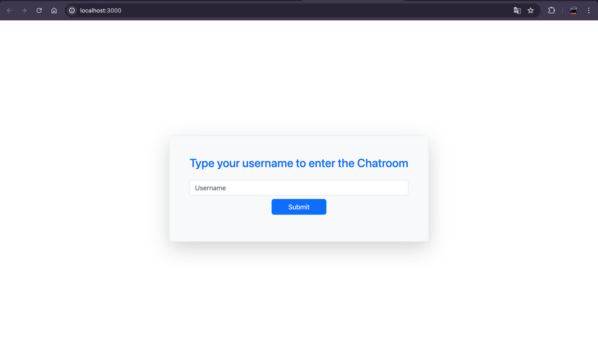
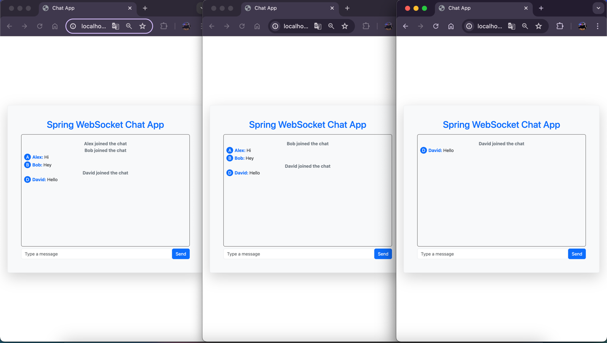
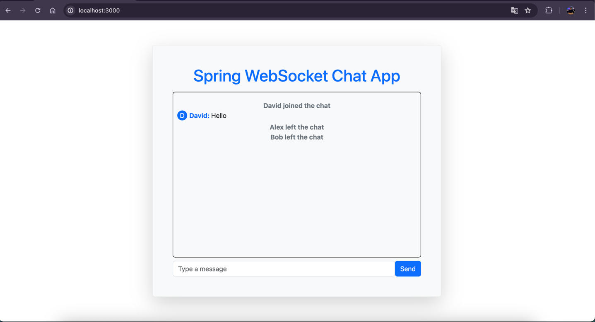

# Spring Boot WebSocket Chat App

This is a simple chat application built using Spring Boot and WebSocket for the backend and React for the frontend.

## Technologies and Libraries Used

### Backend

- **Java 11**
- **Spring Boot**:
    - `spring-boot-starter-websocket`: For WebSocket support.
    - `spring-boot-starter-web`: For building web applications.
- **Lombok**: A Java library that helps reduce boilerplate code.
- **SLF4J**: A simple logging facade for Java.

### Frontend

- **React**: A JavaScript library for building user interfaces.
- **SockJS**: A JavaScript library that provides a WebSocket-like object.
- **@stomp/stompjs**: A STOMP over WebSocket client.
- **Bootstrap**: For styling and responsive design.

## Installation

1. **Clone the repository:**

   ```sh
   git clone https://github.com/yourusername/simple-chat-app.git
   cd simple-chat-app
   ```
   
2. **Backend setup:**

     ```shell
    cd backend
    mvn clean install
    ```
   
3. **Frontend setup:**

    ```shell
    cd frontend
    npm install
    ```
   
## Running the Application

1. **Run the backend:**

    ```shell
    cd backend
    mvn spring-boot:run
    ```
2. **Run the frontend:**

    ```shell
    cd frontend
    npm start
    ```
   
3. **Open your browser and navigate to `http://localhost:3000` to view the chat application.**




